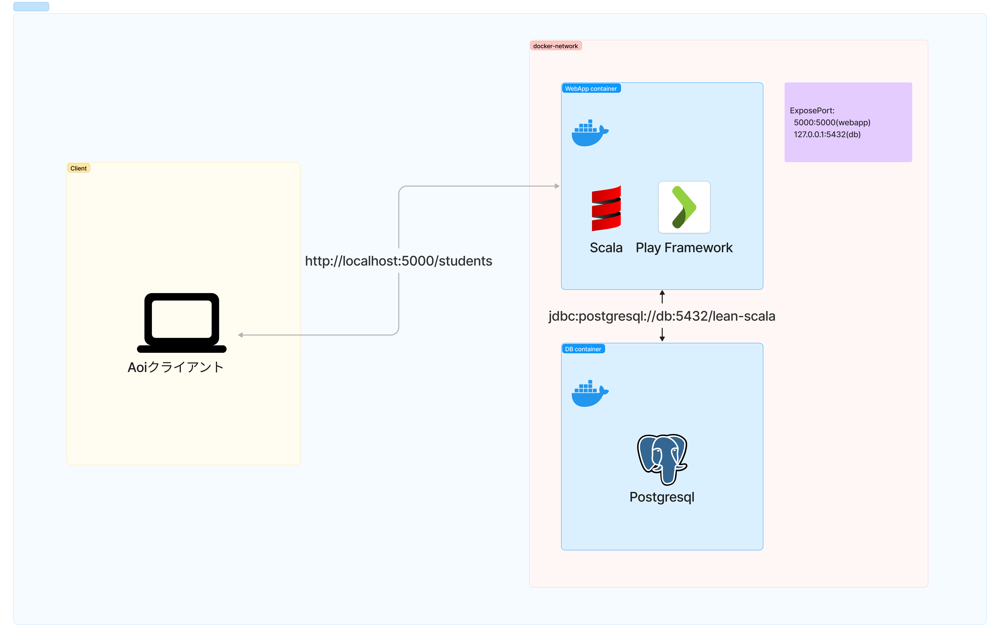

# Learn Scala Play Web API

このプロジェクトは、Scala を使用して Play Framework で構築された Web API です。生徒一覧を取得するエンドポイントを提供します。

## ホスティング

以下の指示に従えばローカルマシン上にプロジェクトのコピーを立ち上げて動かすことができます。

### 前提条件

- [Git](https://git-scm.com/downloads)がインストールされている。
- [Docker](https://www.docker.com/products/docker-desktop)および[Docker Compose](https://docs.docker.com/compose/install/)がインストールされている。

### リポジトリのクローン

以下のコマンドでリポジトリをクローンしてください：

```bash
git clone https://github.com/hrtk91/learn-remix-and-scala.git
```

### アプリケーションの実行

アプリケーションを起動するには、本 ReadMe と同じディレクトリ(learn-scala)から以下のコマンドを実行します：

```bash
docker-compose up --build
```

アプリケーションが起動したら、以下の URL に GET リクエストを行ってください：

```
http://localhost:5000/students?facilitator_id=1
```

## API 仕様

### Path

GET /students

### Parameters

- `facilitator_id` (int): 先生の ID を指定します。必須項目です
- `page` (int): 表示するページ番号を指定します。指定しない場合は 1 です
- `limit` (int): 一ページに表示するデータ数を指定します。指定しない場合は 10 です
- `sort` (string): ソートキーを指定します（許可: name | ログイン ID: loginId）指定しない場合は name です
- `order` (string): 昇順/降順を指定します（昇順: asc | 降順: desc）指定しない場合は asc です
- `key_like` (string): 指定した属性による部分一致検索をします（名前 : name_like | ログイン ID: loginId_like）任意項目です

### Response（成功時）

```json
{
  "students": [
    {
      "id": 1,
      "name": "生徒1",
      "loginId": "student_1",
      "classroom": {
        "id": 1,
        "name": "算数クラス"
      }
    }
  ],
  "totalCount": 1
}
```

## アーキテクチャ

### 構成図



### 採用技術

| 項目                                                                       | バージョン | 説明                               |
| -------------------------------------------------------------------------- | ---------- | ---------------------------------- |
| [Scala](https://www.scala-lang.org/)                                       | 3.3.1      | プログラミング言語                 |
| [Play Framework](https://www.playframework.com/)                           | 3.0.1      | Web アプリケーションフレームワーク |
| [Evolutions](https://www.playframework.com/documentation/2.8.x/Evolutions) | 3.0.1      | データベースのマイグレーション     |
| [anorm](https://www.playframework.com/documentation/2.8.x/ScalaAnorm)      | 2.7.0      | データベースアクセス               |

※ バージョン確認方法

```bash
sbt shell
libraryDependencies
```
